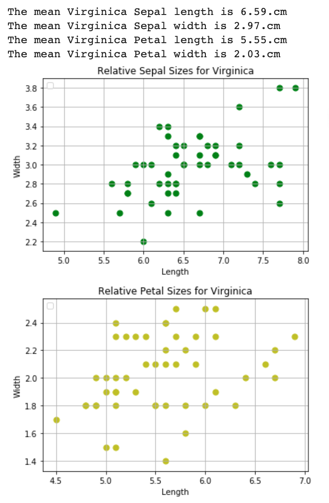
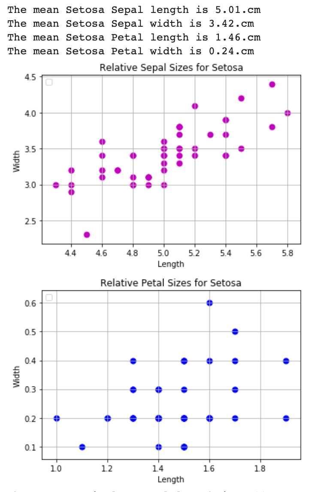
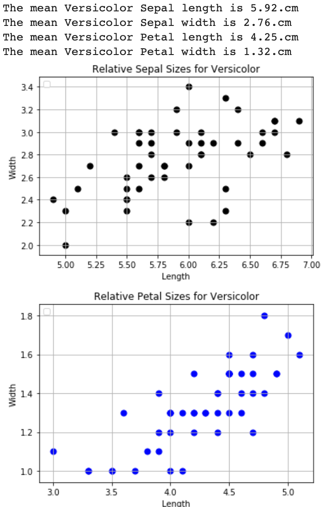
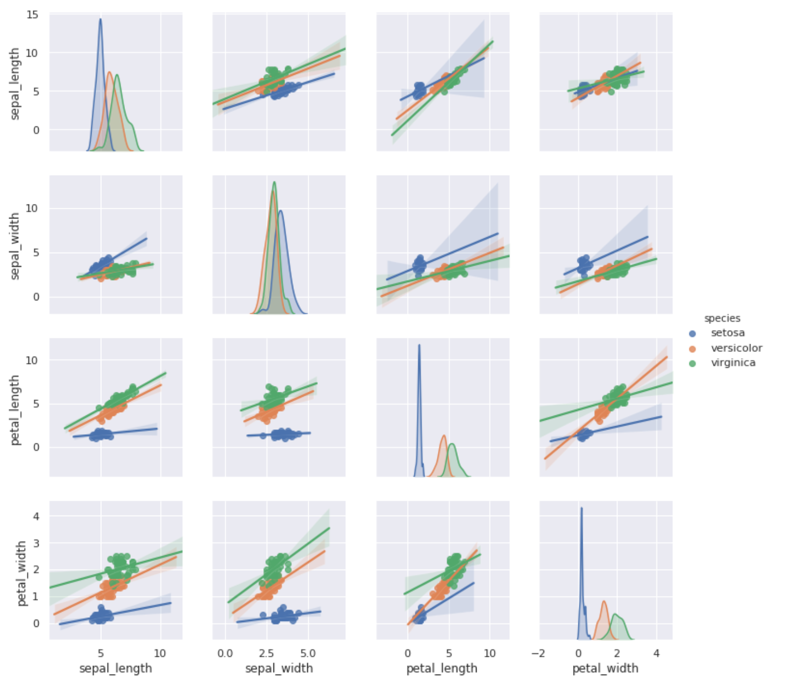
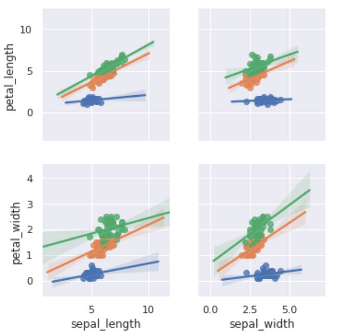
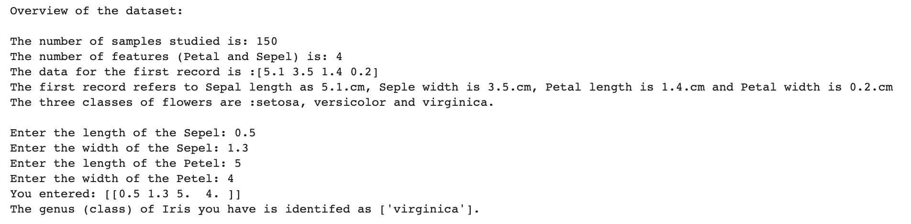

# Exploring the Iris Dataset through Python
## Overview

This relates to the classic Iris dataset. My objective is to understand the Iris dataset, analysis and make some insights into the dataset.

## Objectives of this work

My objective is to demonstrate some of the capabilities of Python in gaining insights from a dataset to an audience who may be aware of statistical methods, but not of Python functionality. I will achieve this by examining the Iris dataset and extrapolating some findings.

## Setup Instructions
The install instructions for MacOS and Windows [here](https://github.com/Rapid130RS/iris_dataset/edit/master/install_instructions.md)

## What is the Iris dataset?

The subject matter of the Iris dataset is a family of 260–300 types of flowers. In 1936 RA Fisher published a 
[paper](https://onlinelibrary.wiley.com/doi/epdf/10.1111/j.1469-1809.1936.tb02137.x "Named link title") in the _Annals of Eugenics_. RA Fisher sought to differentiate between flowers based on their characteristics. In particular, he aimed to assess whether some types (genus) were misclassified. 
The data set contains 150 records of three different types (classes) of iris flowers with numeric values for petal length and width and sepal length and width.

## Why use the Iris Dataset?

The data set has been used to demonstrate how features of an Iris flower can identify the class of Iris. The values for length and width can be used to classify an Iris into one of three classes: _Iris setosa_, _Iris versicolor_, or _Iris virginica_. 
In the paper, a table of values is provided; as can be seen, a visual inspection of the data does not provide any valuable insights.

Python libraries will be of particular use in generating visualiations of the data and in allowing the user obtain a quick overview of the data.

# Utilising Python to Interpret Data

## Gaining Specific Insights using Python Libraries

At RA Fisher's published his paper, collecting, understanding and visualising data was intensive and time consuming. Today,  organisations and individuals want to gain insights from the deluge of data coming their way. Data Scientists have made  Python one of the most popular a way of finding these insights. Python owes its popularity to ease of use and ability to undertake data analysis and visualisation. Python's core capabilities are enhanced with the numerous libraries. During this project, I have used some of the most popular, including Numpy, Matplotlib, Pandas and Scikit Learn.

### Matplotlib Pyplot

[Matplotlib Pyplot](https://matplotlib.org/api/pyplot_api.html) is a library that allows for creation of a wide range of data visualisations. 
Using the Pandas library, I obtained the Iris Dataset and was able to extract descriptive statistics. I began by obtaining the mean for Sepal and Petal Width and Length.

#### Average Values for the Three Classes 

Using the mean values for all classes and for each of the classes did not provide any valuable insights into the differences between the classes.

I separated the data for each class of Iris and sought to visualise the data.
An output of this was a high level analysis of the dispersal of the data. 

##### High Level Analysis of Each Class
 
 

The scatter plot indicates that there are distinct differences in the dispersion of data points for each class of Iris. 

### Seaborn Pairplot

Seaborn Pairplot is an out of the box series of charts  that allowed me to visualise the relationship between the three classes. From these charts I can quickly see how all the variables are related. This would be of help when inferring
which variables have a skewed distribution and as the first step in further analysis.
#### Comparison of The Three Classes Using Seaborn Pairplot

This visualisation clearly shows how _Iris Setosa_ is distinct from _Iris Versicolor_, or _Iris Virginica_ when petal sizes are compared with sepal sizes. This can be seen in the following chart.

### Predictive Analysis using SciKit Learn

[SciKit Learn](https://scikit-learn.org/stable/index.html) is a Python library that provides visualisation and predictive analytics tools. I researched the ability to use SciKit to allow users check if a flower matches one of the classes of Iris. The [SciKit tutorial](https://scikit-learn.org/stable/tutorial/basic/tutorial.html) on this subject led my thinking. 
The [python script](https://github.com/Rapid130RS/iris_dataset/blob/master/scikit.py) allows the user to enter measurements for a flower. The predictive analytics functions assesses if the data matches one of the four classes of Iris recorded in the Iris dataset.

This exercise did not shed any more light on the nature of the dataset, but is a proof of concept for a further iteration that would parse user's inputs and conduct a more sophisticated form of predictive analytics.

### Summary Findings

#### In respect of the Iris Dataset
There are clear distinctions between _Iris Setosa_ is and both _Iris Versicolor_, or _Iris Virginica_. A predictive model could be developed that would allow researchers focus on the relationship between petal and sepal dimensions.

#### In respect of the Python Libraries
The python libraries used show how a descriptive analysis can be conducted, with limited knowledge of Python. A useful feature is that the source of the data was a URL, which could mean that researchers could update this shared resource, that could produce periodical reports. 
The libraries also demonstrated that a predictive model can be created that would allow researchers to categorise classes of Iris by their measurements.  

